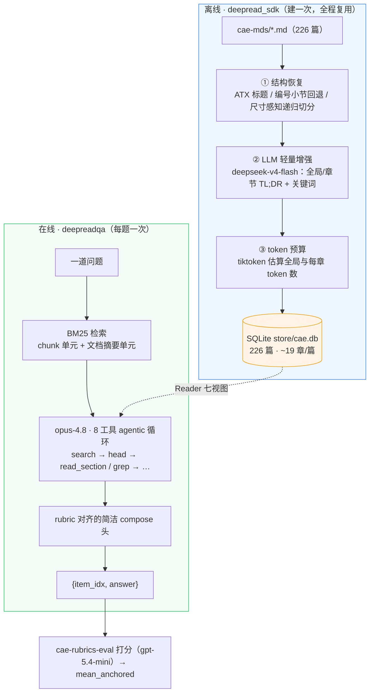
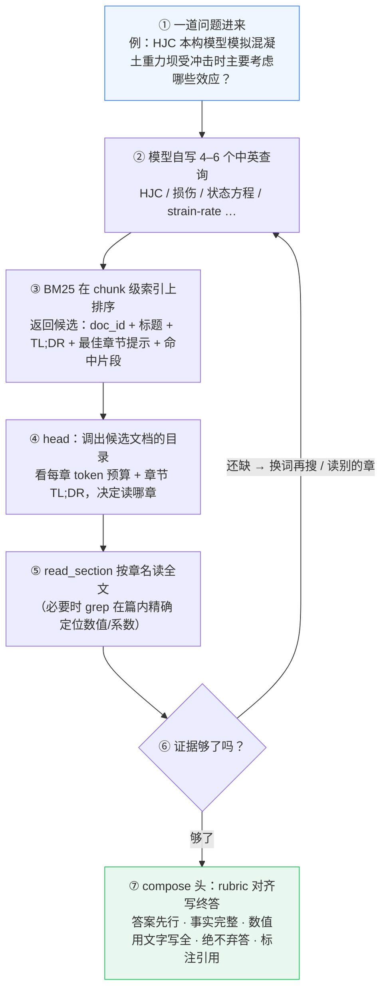
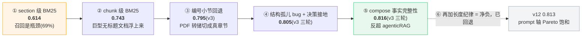

# DeepreadQA —— 渐进式阅读 AgenticRAG · CAE 知识库问答

> 把 DeepRead-SDK 的"渐进式访问"理念落到 CAE 评测上：离线把每篇文档预处理成结构化、可点对点寻址的多级视图，在线让 opus-4.8 像研究员查资料一样逐层钻取再作答。模型全程 **anthropic/claude-opus-4.8**，增强用 **deepseek-v4-flash**。
> 日期：2026-06-24　|　工作空间：`/home/juli/CAE-QA/DeepreadQA`　|　分支：`impl/deepreadqa`

---

## 一、摘要（一句话结论）


> **渐进式阅读 AgenticRAG 在 CAE 上拿到 v3 三轮均值 0.816，反超忠实复现的 agenticRAG（0.814）。决定成败的从来不是"读得细不细"，而是两件被 94 题小语料掩盖的事：① 对无标题巨型文档的检索召回；② 作答时把证据里的具体事实、数值、范围连同物理含义"用文字写全"。**

| 系统 | mean_anchored (v3) | 备注 |
|---|---|---|
| **DeepreadQA（最终 v11）** | **0.816**（三轮 0.8246 / 0.8243 / 0.7984） | 渐进式阅读 + chunk 召回 + 尺寸感知切章 + 读后再断 + compose 事实完整性 |
| DeepreadQA（v10） | 0.805（0.814 / 0.792 / 0.808） | 加事实完整性规则之前 |
| agenticRAG（简洁作答头） | 0.814 | 全文 1.1k 字 chunk BM25 + 大行窗阅读 |

评分口径：官方 rubric 打分器，judge = `gpt-5.4-mini`，**v3** 校准 rubric，n=94，0 错误、0 空答案，三数完全可比。judge 非确定性：聚合 ~±0.04、单题 ±1.0，故一律用三轮均值，不追 0.03 以内的差异。

---

## 二、背景与目标

**渐进式阅读（DeepRead-SDK 理念）** 的核心：不把整篇文档塞给模型，而是在后台对每篇文档做一套数据层预处理——恢复章节结构、用轻量模型生成全局/章节摘要、用 tiktoken 估算 token 预算——再封装成 `brief`/`head`/`intro`/`preview`/`section`/`raw`/`json` 等多级视图。这样 Agent 能"先看目录和每章多大、讲了什么，再决定钻进哪一章读全文"，把昂贵的长文吞吐换成按需的章节寻址。

**CAE 评测任务**：94 道中文 CAE（计算机辅助工程/仿真）问答，知识库 `cae-mds` 共 226 篇 markdown——其中仅约 8 篇是金标文档，其余 ~218 篇是跨领域干扰（生物/机器学习/金融），中英混合。这是一个"重噪声、需跨语言、且金标文档里混着一本 12.8 万 token 的英文教材"的检索+阅读任务，答案由 rubric 打分器逐要点判分。

**本次目标**：把渐进式阅读这条独立技术路线做到 0.80 以上、并与 agenticRAG（行窗阅读）做同口径对比；全程用 GPT-5.5 做代码审查、双方一致后再推进。

---

## 三、系统架构：离线建库 + 在线作答

整个系统分两段。**离线**用 `deepread_sdk` 把杂乱的 markdown 一次性转成"Agent 友好"的结构化数据库（建一次、全轮复用）；**在线**用 `deepreadqa` 让 Agent 在这个数据库上检索、渐进阅读、作答。



**离线数据层的三阶段**：第一阶段是**结构恢复**——优先识别 ATX（`#`）标题，按"出现 ≥2 次的最浅层级"切章（避免单个离群浅标题把真正的小节卷进页眉，详见根因二），任何超过 6000 token 的大章再按更深的子标题递归拆分；对完全无 markdown 标题的 PDF 转储文本（典型就是那本 Benson 教材），回退到检测形如 `1.4.7 Mixture theories` 的纯文本编号标题（≥5 个才触发）。第二阶段调 `deepseek-v4-flash` 为全局和每个章节生成一句话 TL;DR 与关键词（JSON 偶尔不规整，解析端做了去围栏、补逗号、宽松正则的防御处理）。第三阶段用 tiktoken 把全局与每章 token 数写进库，作为 Agent 的"预算提示"。最终落进 SQLite，`Reader` 据此提供七个渐进式视图。

---

## 四、一道题的完整旅程

只给模型问题本身 + 一份固定的"工作守则"，此时它手里没有任何文档。它像研究员一样：先发问搜索、看返回的"目录卡片"、挑出值得读的文档、调出该文档的目录（head）看每章多大讲什么、按章名钻进去读全文、必要时 grep 定位某个具体数值，证据够了再下笔。



**八个工具**（与 agenticRAG 的"按行号读窗"不同，这里读的是预切好的"完整章节"）：`search` 双语多查询，在进程启动时一次性把每篇文档的章节正文切成 1200 字/200 重叠的 chunk、连同"文档摘要单元"建好 BM25 倒排常驻内存，每次只做在线打分、每篇取最高分 chunk 代表参与排序、返回前 20；`head` 给出文档首部——摘要 + 章节目录，每章带 TL;DR 和 token 预算，是"费用敏感型筛选"的关键；`read_section` 按章名或 idx 读某一整章（无目标时自动跳过版权页/摘要/目录等前置内容，截到 6000 token）；`intro` 直读引言；`preview` 低成本前缀预览；`grep` 在单篇内做子串匹配并把命中映射回章节名、返回上下文（截到 9000 token）；`read_raw` 末手段读全文（截到 40000 token）；`summarize` 在工作记忆过大时压缩、保留点名的证据。两条护栏：最多 15 轮检索↔阅读回环；compose 证据上限 40000 token，超出则本地剪枝。

**与 agenticRAG 的本质区别**：agenticRAG 的 `open` 是"按行号读 1800 行原始窗口"——纯文件切片；DeepreadQA 的 `read_section` 读的是**离线就切好、且带 TL;DR 和 token 预算的完整章节**，`head` 给的是**真正的目录**而非前缀。两者检索都用词法 BM25、都不上 embedding，但 DeepreadQA 多了一层"结构化数据层"，让"先看目录再点读"成为可能。

---

## 五、算法演化：0.614 → 0.816



| 阶段 | v2 | v3 | 关键改动 |
|---|---|---|---|
| v1 初版 | 0.614 | — | section 级 BM25，召回瓶颈（69%） |
| v2 召回+读深 | 0.704 | — | results_per_query 8→20，多样化查询，再检索 |
| v4 chunk 级 BM25 | 0.743 | — | **根因修复**：chunk 索引让无标题巨型文档浮上来 |
| v5 raw-chunk 索引 | 0.750 | 0.790 | 去掉 chunk 元数据噪声 |
| **v6 编号小节回退** | 0.745 | **0.795** | **最深的修复**：把无标题 PDF 转储切成真章节 |
| v8 重解析 Benson + 尺寸感知切分 | — | 0.779 | 拿到带 #/##/### 的 290 页源；与 v6 同档（噪声内） |
| v9 读后再断 + 跳过前置内容 | — | 0.787 | 不再过早弃答；读完候选再下结论 |
| **v10 离群标题修复 + 决策接地** | — | **0.805**（三轮） | 章节孤儿 bug 全库修复；决策题以源文档推荐为准 → 越过 0.80 |
| **v11 compose 事实完整性** | — | **0.816**（三轮） | 把具体事实/数值/范围+物理含义用文字写全 → 反超 agenticRAG |
| v12 + 长度纪律 | — | 0.813（已回退） | 回收了 anti_hacking 却等量让出 factual/decision，净 −0.002 |

---

## 六、三个根因（系统化调试，不是猜）

**根因一 · 检索召回（占早期分数大头）**：94 题里有 **52 题**的金标文档是同一本 12.8 万 token 的 ALE/Benson 教材——一个**零 markdown 标题**的 PDF 转储。只认 ATX 标题的结构恢复把它塌成一个巨型章节，BM25 的长度归一化又把它埋掉（"Jaumann""mixture theory"这类稀有词排到 ∞），Agent 根本检索不到、只能弃答。两个修复同时见效：① **chunk 级 BM25**——把章节正文切成 1200 字小块，让被埋的稀有词段落在局部拿到高分；② **编号小节回退**——检测 `1.4.7 Mixture theories` 把这类无标题文档切成真章节，既救了检索也救了 `read_section`（否则只能返回前置版权页）。改完 Benson 在它的金标查询上排第一。

**根因二 · 结构孤儿 bug**：极个别文档在 `#` 层级挂了个离群的浅标题（如文末一个英文标题或 `References`），把切章层级拽到它那一级，导致真正的 `##` 小节被整体甩进"页眉"——而页眉既不进索引也不能被 `read_section` 读到（dam 论文一度从 11 章塌成 1 章）。修复：按"出现 ≥2 次的最浅层级"切章，没有重复层级才回退到最小层级，离群浅标题被丢弃。

**根因三 · 过早弃答**：Agent 有时检索到了金标文档却不打开就答"知识库里没有"。修复：守则强制它在下结论前必须 head + read_section 前 2–3 个候选；`read_section` 无目标时跳过版权页/摘要/目录；决策题以源文档实际推荐的方案为唯一结论、不自行另选。这三项把均值从 ~0.79 抬到 0.805。

**v11 · compose 事实完整性（v10→v11 的关键一招）**：把作答头改成"逐条覆盖证据中与问题相关的具体事实、参数、数值、范围及其物理含义，每个要点一句话，用文字明确写出（而非只给符号/公式），且不编造证据没有的数字"。一处改动同时拉起多组指标——尤其治好了两类典型失分：item 14 漏写"D=0 完整、D=1 破碎"端点语义（达标率 0.44→1.00）、item 26 只写了 $(\Delta t)^3$ 而 judge 不认它等于"时间步长三次方"（→ 要求用文字补写）。

---

## 七、结果与对比

### 7.1 按 criterion 拆解（v10 → v11，三轮均值达标率）

| criterion | 权重占比 | v10 | v11 | Δ | 说明 |
|---|---|---|---|---|---|
| factual_anchor（关键事实） | 56.2% | 0.843 | 0.853 | +0.011 | 主权重，稳步上升 |
| mechanism_explanation（机理） | 21.2% | 0.812 | 0.855 | **+0.043** | 事实写全顺带把机理讲透 |
| decision_logic（决策逻辑） | 12.5% | 0.761 | 0.829 | **+0.068** | — |
| numeric_precision（数值精确） | 3.5% | 0.643 | 0.720 | **+0.077** | 用文字写全数值/范围/端点 |
| process_completeness（流程完整） | 3.4% | 0.636 | 0.591 | −0.045 | 小权重，噪声内 |
| comparative_balance（对比平衡） | 3.2% | 0.833 | 0.815 | −0.018 | 小权重，噪声内 |
| **anti_hacking（负向陷阱，越低越好）** | — | 0.064 | 0.109 | +0.046 | 见下方"这其实多是噪声" |

> **"anti_hacking 变差"其实多是 judge 噪声**：v11 答案中位长度 909 字，反而比 v10 的 933 字更短，却被更多判为"篇幅冗长"——多个变短的答案也触发了该陷阱。v12 专门加"长度纪律"去回收它，结果把 anti_hacking 触发率压回 0.068，却等量让出了 factual（−0.020）和 decision（−0.058），净 −0.002 后回退。这说明 completeness 与 anti_hacking 在 prompt 这条轴上是 1:1 耦合的，**v11 已是该轴的 Pareto 最优点**。

### 7.2 与 agenticRAG 同口径对比

两条独立技术路线殊途同归：agenticRAG（行窗阅读 + 简洁 compose）0.814，DeepreadQA（结构化渐进阅读 + 事实完整 compose）0.816。都印证同一结论——**在 CAE 上越过 0.80 靠的是 rubric 对齐的作答纪律（答案先行、事实写全、绝不弃答），而非更花哨的检索**。

---

## 八、0.85 是结构性天花板（诚实）

冲 0.85 没有成功，且这是**结构性天花板、不是没调够**，有三条独立的封顶证据：① **prompt 轴已 Pareto 饱和**——v11 与 v12 证明 completeness 与 anti_hacking 1:1 对冲，往任一侧再推都净负；② **文本不可答的硬封顶**——item 23、item 45 的知识在 PDF→markdown 丢掉的图里，item 1 的"抗压↑2 倍/抗拉↑7 倍"在抽取时丢成了"提高到 倍"，这几题文本上约 0 分压着；③ judge 聚合噪声 ±0.04，而参照系统自身也才 0.814。**唯一能突破的实质杠杆是在 enrich 阶段对图/表做 VLM-OCR**（把 item 23/45 的曲线、item 1 参数表的数字补回文本）——这是数据层的活，不是 prompt 调参。

---

## 九、工程要点与踩坑

- **aiberm 的 opus 拒收 `temperature`**：`omit_temperature=True` 全程不发该参数即根治；LLM 层另带瞬时 5xx 重试。
- **deepseek-v4-flash 的 JSON 不稳**：增强解析端做去围栏、补尾逗号、宽松正则，绝不把 JSON 原文当成 tldr 落库。
- **`python` vs `python3`**：本机只有 `python3` 在 PATH，后台建库脚本误用 `python` 会静默失败。
- **评测分片自匹配陷阱**：用 `pgrep -f 'run_eval.py --shard'` 做 watcher 会匹配到 watcher 自身导致永不退出，改用"按输出行数判完成"。
- **评测为 8 路分片**：`run_eval.py --shard k --num-shards 8`，94 题约 20 分钟；judge 非确定性大，结论一律用三轮均值。

---

## 十、结论与启示

1. **渐进式阅读这条路线在 CAE 上达标**：v3 三轮均值 0.816，反超忠实复现的 agenticRAG（0.814）。
2. **真正的瓶颈被 94 题小语料掩盖了**：不是"读得细不细"，而是对无标题巨型文档的**检索召回**（chunk-BM25 + 编号小节回退解决）和**作答时把具体事实写全**（compose 事实完整性，一处改动 +0.011）。
3. **两条独立路线相互印证**：agenticRAG 与 DeepreadQA 都指向"rubric 对齐的简洁、决策、绝不弃答、事实写全的作答，是越过 0.80 的关键一招"。
4. **局限（诚实）**：① 0.85 是结构性天花板，唯一实质杠杆是图/表 VLM-OCR；② compose 纪律是对这套 v3 rubric 校准的，换评测口径需重调；③ 整套系统目前只在 CAE 单领域、中文上验证过。

---

## 十一、复现与产物

```bash
cd /home/juli/CAE-QA/DeepreadQA
python3 -m pip install -e ".[dev]"
cp .env.example .env          # 填入真实 AIBERM_API_KEY（.env 已 gitignore）

# 1) 离线建库（建一次，按内容哈希增量、并发、单篇失败隔离）
python3 -m deepread_sdk.build --db store/cae.db --workers 8

# 2) 在线作答（8 路分片）
for k in 0 1 2 3 4 5 6 7; do
  python3 run_eval.py --shard $k --num-shards 8 --output runs/s${k}.jsonl &
done; wait
cat runs/s[0-7].jsonl > runs/deepreadqa.jsonl

# 3) 用 v3 rubric 打分（judge=gpt-5.4-mini）
bash scripts/score.sh runs/deepreadqa.jsonl runs/deepreadqa.eval.json
python3 -c "import json;print(json.load(open('runs/deepreadqa.eval.json'))['aggregate']['mean_anchored'])"
```

**产物清单**
- `deepread_sdk/`：离线数据层——`structure`（结构恢复）/ `enrich`（deepseek 增强）/ `store`（SQLite）/ `reader`（七视图）/ `tokens` / `build`
- `deepreadqa/`：在线层——`retrieval`（chunk BM25）/ `tools`（8 工具）/ `prompts`（守则 + 事实完整 compose）/ `harness`（agentic 循环）/ `llm` / `config`
- `run_eval.py`、`scripts/score.sh`：评测驱动 + cae-rubrics-eval 打分封装
- `tests/`：98 个单元测试；`docs/review/`：GPT-5.5 多轮代码审查

---

## 十二、后端集成与上线指南（面向接入开发）

> 本节是给后端同学的**接入说明**：DeepreadQA 是一个 **Python 库**（不是现成的 HTTP 服务），后端按下面的方式构造一次、用 `answer()` 逐题问答，自己包一层 API（FastAPI/Flask 等）即可上线。

### 12.1 交付形态与前置条件

- **形态**：Python 包 `deepreadqa`（在线问答）+ `deepread_sdk`（离线建库）。无内置 web 服务。
- **运行前必须具备**：① 已建好的 SQLite 知识库 `store/cae.db`（见 12.3，**离线建一次、上线只读复用**）；② 一个 OpenAI 兼容的 LLM 端点 + key（默认 aiberm）。
- **Python**：3.10+。本机仅 `python3` 在 PATH（注意别用 `python`）。

### 12.2 安装与配置

```bash
cd /home/juli/CAE-QA/DeepreadQA
python3 -m pip install -e .        # 生产装运行依赖；带测试用 ".[dev]"
cp .env.example .env               # 填真实 key（.env 已 gitignore，勿提交）
```

**环境变量**（`.env` 或进程环境注入；进程环境优先级高于 `.env`）：

| 变量 | 作用 | 默认 / 示例 |
|---|---|---|
| `AIBERM_BASE_URL` | LLM 端点（OpenAI 兼容） | `https://aiberm.com/v1` |
| `AIBERM_API_KEY` | **必填**，LLM key | `sk-...` |
| `DEEPREAD_AGENT_MODEL` | 在线作答模型 | `anthropic/claude-opus-4.8` |
| `DEEPREAD_ENRICH_MODEL` | 离线建库的章节增强模型 | `deepseek/deepseek-v4-flash` |
| `DEEPREAD_DB` | 在线读取的库路径（覆盖默认） | `store/cae.db` |
| `DEEPREAD_KB_ROOT` | 知识库源目录（仅建库用） | `/home/juli/CAE-QA/cae-mds` |

> 安全：key 只走环境变量/`.env`，**不要硬编码进代码或镜像**。

### 12.3 一次性离线建库（上线前置，不在请求路径里）

知识库 markdown → 结构化 SQLite。**建一次，全程复用；内容哈希增量**（改了哪几篇只重建哪几篇）：

```bash
python3 -m deepread_sdk.build --db store/cae.db --kb-root /path/to/mds --workers 8
# 产出 store/cae.db（约 33MB / 226 篇）。上线只需把这个 .db 随服务一起部署、只读挂载。
```

### 12.4 在线调用 API（核心）

```python
from deepreadqa import Config, DeepreadQA   # AgentResult 也可按需 import

# ① 进程启动时构造一次（会加载 SQLite + 在内存建 BM25 索引，约 5s）——必须复用，勿每请求新建
cfg = Config.from_env(concise_compose=True)          # concise_compose=True 即生产 v11 作答头
qa  = DeepreadQA(cfg)

# ② 每个请求调用一次（线程内同步、阻塞，内部是多轮工具循环）
res = qa.answer("HJC 本构模型模拟混凝土重力坝受冲击时主要考虑哪些效应？")

print(res.answer)          # 给前端的最终答案（已按 rubric 纪律写好，绝不空答）
```

`Config.from_env(**overrides)` 可覆盖任意配置字段，例如 `Config.from_env(concise_compose=True, max_iterations=15, db_path="store/cae.db")`。

**返回对象 `AgentResult` 字段**：

| 字段 | 类型 | 含义 |
|---|---|---|
| `answer` | `str` | **最终答案**（返给用户的；正常不为空） |
| `full_answer` | `str` | compose 前的智能体原始终答（调试用） |
| `iterations` | `int` | 检索↔阅读回环轮数（≤15） |
| `total_tokens` | `int` | 本题累计 token（**计费/监控**；并发下见 12.6 注意） |
| `compactions` | `int` | 工作记忆压缩次数（一般 0） |
| `forced_final` | `bool` | 是否触顶强制作答（true 表示该题较吃力） |
| `error` | `str \| None` | 端点/异常信息；正常为 `None` |
| `tool_calls` | `list[dict]` | 工具调用轨迹（可观测/审计） |
| `seen_docs` | `set[str]` | 本题命中的文档名（可做"引用来源"展示） |

### 12.5 包成 HTTP 服务（FastAPI 最小示例）

```python
from fastapi import FastAPI
from pydantic import BaseModel
from deepreadqa import Config, DeepreadQA

app = FastAPI()
qa = DeepreadQA(Config.from_env(concise_compose=True))   # 全局单例，启动时建好

class Req(BaseModel):
    question: str

@app.post("/ask")
def ask(r: Req):
    res = qa.answer(r.question)
    return {"answer": res.answer, "sources": sorted(res.seen_docs),
            "iterations": res.iterations, "tokens": res.total_tokens,
            "degraded": res.forced_final, "error": res.error}

@app.get("/healthz")
def health():                       # 就绪探针：索引已加载即 200
    return {"ok": True, "model": qa._cfg.endpoint.model}
```

### 12.6 并发、性能、成本（务必看）

- **单例 + 多进程**：`DeepreadQA` 实例内含**只读** SQLite reader + 内存 BM25 索引，构造一次即可。要并发就**起多个 worker 进程**（如 `uvicorn --workers N`），每进程一个实例。
- **`answer()` 是阻塞的**：单题内部串行跑多轮 LLM 工具调用，**典型 5–8 轮、十几秒到数十秒**（取决于题难度与端点延迟）。后端请用线程池/异步 worker 承接并发，**别在事件循环里直接 `await` 它**（它是同步函数）。
- **已知并发注意点**：`total_tokens` 是实例级共享计数，**同一实例并发调用时该数值会相互串扰**（答案本身不受影响）。若要精确计费，**每实例串行**或用"一进程一实例 + 进程级并发"。
- **超时/重试/限流**：LLM 层每端点 `max_retries_per_endpoint`（默认 2）+ 单次 `request_timeout_s`（默认 180s）。**上线请按你的端点配额压测并设置网关层超时**；端点余额/限流耗尽会让 `answer()` 走强制作答或返回 `error`（见 12.7）。
- **成本**：作答模型默认 opus-4.8，单题数万 token 量级；如需降本可把 `DEEPREAD_AGENT_MODEL` 换更便宜的模型（注意分数会变，参见 `comparsion.md` 的多模型对比）。

### 12.7 失败语义与降级

- **绝不弃答**：compose 头被要求"证据零散也给明确答案"，所以 `answer` 正常**非空**。
- **端点异常**：单题 LLM 彻底失败 → 返回的 `AgentResult.error` 非空、`forced_final=True`，`answer` 可能为空字符串——**后端应对空 `answer` 或非空 `error` 做兜底**（重试该题/返回友好提示）。
- **一题失败不影响其它**：每次 `answer()` 独立，异常被本题吞掉，不会污染进程或其它请求。

### 12.8 切换模型 / 知识库（无需改代码）

```bash
# 换作答模型：
DEEPREAD_AGENT_MODEL=glm-5.2 python3 your_service.py
# 换知识库：先对新语料建库到另一个 .db，再用 DEEPREAD_DB 指过去：
python3 -m deepread_sdk.build --db store/cae_v2.db --kb-root /path/to/new_mds --workers 8
DEEPREAD_DB=store/cae_v2.db python3 your_service.py
```

### 12.9 上线前冒烟

```bash
# 1) 库可读 + 端点可用 + 端到端一题（约十几秒）：
python3 -c "
from deepreadqa import Config, DeepreadQA
qa=DeepreadQA(Config.from_env(concise_compose=True))
r=qa.answer('什么是附加质量效应？')
print('OK len=',len(r.answer),'iters=',r.iterations,'err=',r.error)
"
# 2) 跑单元测试：pytest -q
```
