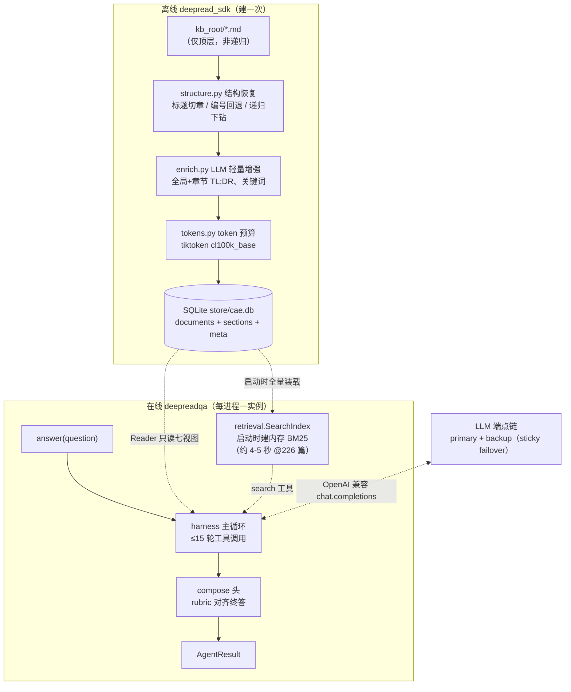
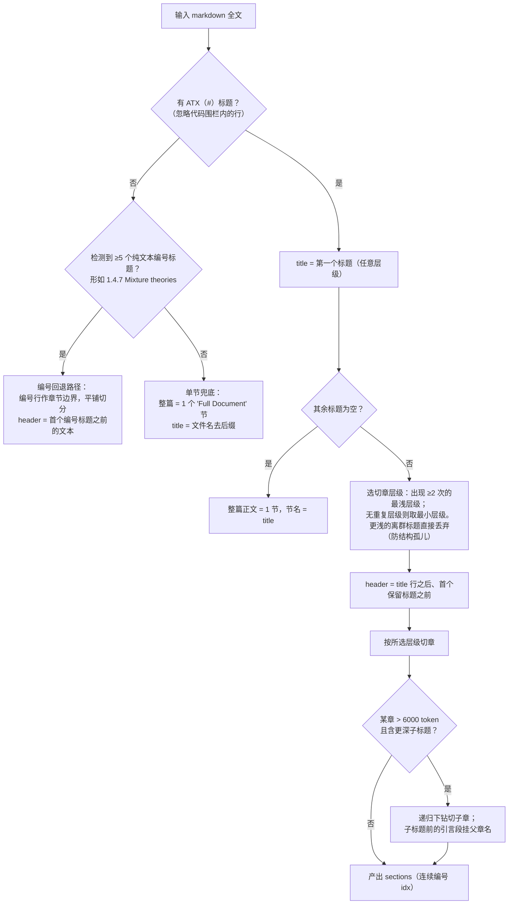
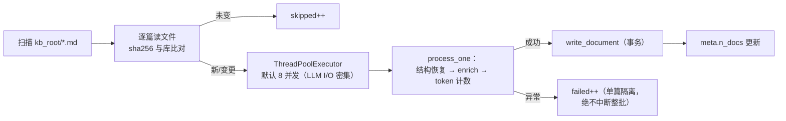
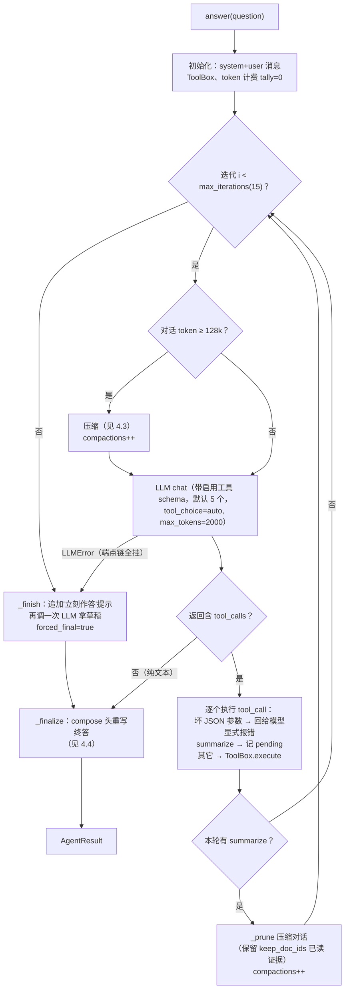
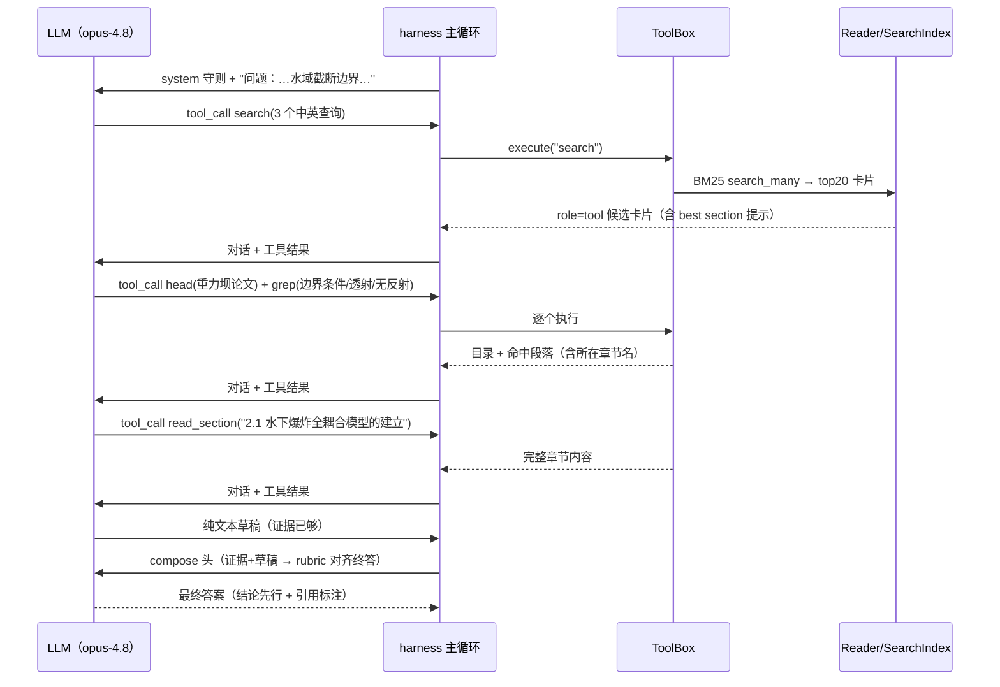
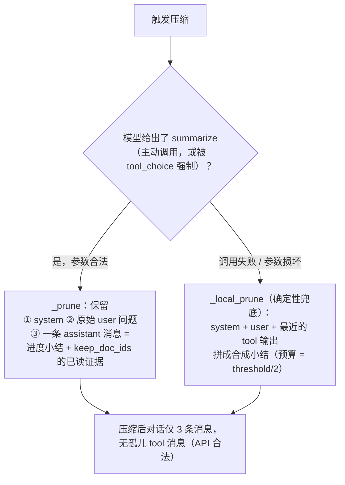
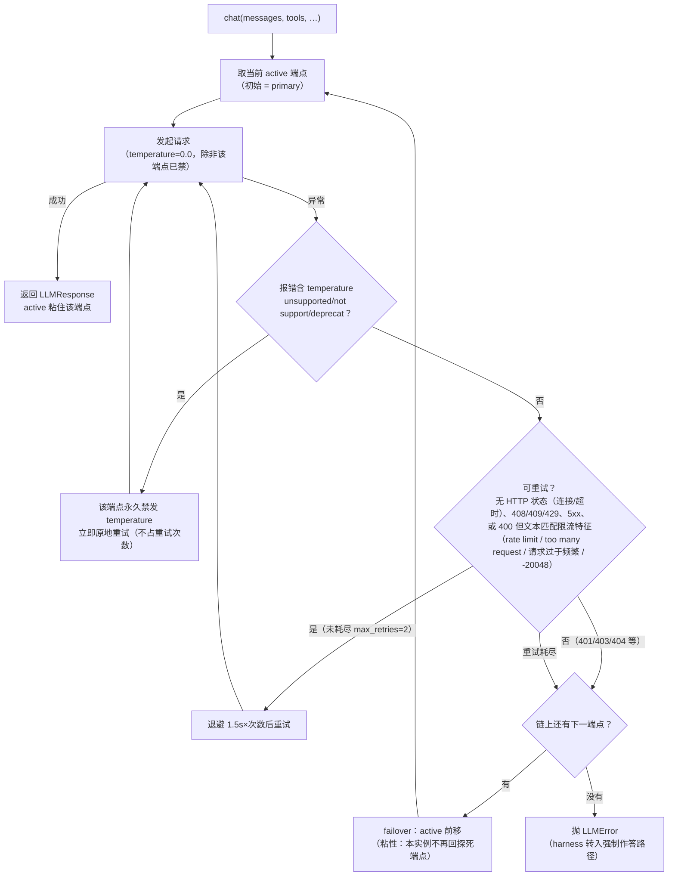

# DeepreadQA 算法文档（后端开发对接版）

> 本文面向**接入/复刻/运维**本系统的后端开发，完整描述算法流程、每个工具的构造与使用、数据预处理细节、消息协议与失败语义。所有格式模板、截断阈值、默认值均逐字取自代码并经测试验证。
>
> 与 `README.md` 的分工：README §12 讲**怎么部署怎么调用**（安装、FastAPI 包装、冒烟）；本文讲**内部怎么运转**——你不需要读源码就能按本文实现或排障。
>
> 对应代码版本：`main` @ `e7eff28` + 2026-07-03 修复批次（keep_doc_ids 保留、坏 JSON 工具参数显式反馈、token 计费并发安全、重试分类 + 端点 failover、`run_eval --resume`、`intro` 跳过前置内容）+ 2026-07-04 默认工具面变更（**默认禁用 intro/preview/read_raw**，消融验证见 §5）+ **2026-07-07/08 论文对齐批次**（search 卡片带 `[章节idx] (~¶段落)` 坐标锚点、`read_section` 段落分页 `start_para/end_para`、catalog 注入模式 `DEEPREAD_CATALOG`、英文作答开关 `DEEPREAD_ANSWER_LANG`、评测集覆盖 `DEEPREAD_EVAL_FILE`、enricher 关键词数/预算/超时参数化；战役报告见 `docs/deepread_paper_alignment.md`）。文中行号仅供参考，以文件内搜索为准。

---

## 目录

1. [系统总览](#1-系统总览)
2. [数据预处理（离线建库）](#2-数据预处理离线建库)
3. [在线检索索引](#3-在线检索索引进程启动时构建)
4. [在线问答主循环](#4-在线问答主循环)
5. [八个工具逐一规格](#5-八个工具逐一规格)
6. [LLM 层协议：重试与 failover](#6-llm-层协议重试与-failover)
7. [配置全表](#7-配置全表)
8. [评测驱动 run_eval.py](#8-评测驱动-run_evalpy)
9. [后端落地清单与常见坑](#9-后端落地清单与常见坑)

---

## 1. 系统总览

系统分**离线**与**在线**两段，共享一个 SQLite 库：

- **离线（`deepread_sdk/`）**：把杂乱的 markdown 语料一次性转成结构化、可按章节寻址的 SQLite 库（建一次、只读复用）。
- **在线（`deepreadqa/`）**：进程启动时在库上构建内存 BM25 索引；每题跑一个多轮工具调用的 agentic 循环，最后经 compose 头产出最终答案。



**代码地图**（全部 ≤300 行/文件）：

| 文件 | 职责 |
|---|---|
| `deepread_sdk/structure.py` | 结构恢复：markdown → title/header/sections（含字符偏移） |
| `deepread_sdk/enrich.py` | LLM 增强：全局/章节 TL;DR + 关键词，防御性 JSON 解析 |
| `deepread_sdk/tokens.py` | tiktoken 计数与截断（无 tiktoken 时 `len//4` 兜底） |
| `deepread_sdk/store.py` | SQLite DDL、写入（事务）、读取、content_hash 增量 |
| `deepread_sdk/reader.py` | 只读七视图：brief/head/intro/preview/section/raw/json |
| `deepread_sdk/build.py` | 建库 CLI：并发 enrich、单篇失败隔离、增量跳过 |
| `deepreadqa/retrieval.py` | 内存 BM25：文档摘要单元 + 1200 字 chunk 单元 |
| `deepreadqa/tools.py` | 工具 JSON Schema 与执行器（ToolBox）：8 个定义，**默认启用 5 个** |
| `deepreadqa/prompts.py` | 系统守则、强制作答/压缩提示、compose 头 prompt |
| `deepreadqa/harness.py` | agentic 主循环、上下文压缩、compose、token 计费 |
| `deepreadqa/llm.py` | 端点链客户端：重试分类、sticky failover、temperature 自愈 |
| `deepreadqa/config.py` | 全部可调参数（frozen dataclass）+ 环境变量装配 |
| `run_eval.py` | 评测驱动：分片、断点续跑、预测/轨迹双输出 |

**实测规模参考**（`store/cae.db`，226 篇 CAE 语料）：4220 个章节、14659 个 BM25 单元；进程冷启动 = 装载 0.2s + jieba 词典 0.8s + 建索引 3.7s ≈ **5s**。

---

## 2. 数据预处理（离线建库）

### 2.1 输入约定

- **输入**：`--kb-root` 目录下的 `*.md` 文件（**仅顶层，`glob("*.md")` 不递归子目录**），UTF-8（读取用 `errors="ignore"`）。来源通常是 MinerU / WisDoc 等 PDF→markdown 转换产物。
- **doc_id = 文件名（含 `.md` 后缀）**，如 `水下爆炸冲击荷载作用下混凝土重力坝的破坏模式.md`。全链路（检索卡片、工具参数、引用标注）都用这个 doc_id，改名即换 id。
- **一致性红线**：全库（金标 + 噪声）必须用**同一个 enricher 同一批跑**。只增强部分文档会改变检索公平性，评测结论作废。

### 2.2 结构恢复（`structure.py::recover_structure`）

把一篇 markdown 切成 `title` + `header`（题头/前言区）+ `sections[]`。每个 section 带 `name/idx/content/start_pos/end_pos`，其中 **start_pos/end_pos 是 content 在原文中的字符偏移**（满足 `text[start:end] == content`），供 grep 把行号命中回映射到章节名。



关键规则，逐条解释（都对应真实翻过车的案例）：

1. **“出现 ≥2 次的最浅层级”切章**：个别文档在 `#` 层级挂了一个离群标题（如文末英文题名、`References`），若按“最浅层级”天真切章，会把真正的 `##` 小节整体卷进 header——header 既不进索引也读不到（一篇 11 章的论文曾塌成 1 章）。所以只有**重复出现**的层级才有资格作为切章层级，比它更浅的孤例被丢弃。
2. **>6000 token 递归下钻**（`_MAX_SECTION_TOKENS = 6000`）：教科书式“# 第一章”内含 `## 1.1`/`### 1.4.5` 时，超大的章按更深层级递归拆成可寻址子章；子标题之前的“章引言”文本单独成节、名字挂父章名。
3. **编号小节回退**（`_MIN_NUMBERED = 5`）：零 markdown 标题的 PDF 转储（典型：12.8 万 token 的 Benson ALE 教材，占评测金标的 ~55%）会塌成单节，既读不了也检索不到。回退检测纯文本编号标题，正则为：
   ```
   ^\s*(\d{1,2}(?:\.\d{1,2}){0,3})\.?\s+([A-Z][^\n]{2,70})$
   ```
   附加过滤：首段编号 ≤50；标题 ≤10 个词；不以 `the/a/this/we/in/for/it/these/where/river/street` 开头；不是超过 40 字符的全大写行。**≥5 个命中才启用**（防止把普通编号句当标题）。注意标题须以大写字母开头——该回退是给英文 PDF 转储设计的。
4. **代码围栏内的“标题”忽略**：``` 与 ~~~ 各自独立配对（``` 只能被 ``` 关闭），围栏内的 `#` 行不算标题。
5. **摘要抽取**（`extract_abstract`）：优先找名为 `Abstract`/`摘要`（容忍尾部 `.`/`:`）的 section；否则在 header 里找 `abstract:/摘要：` 行内内容；都没有则为 `None`。
6. **语言检测**（`detect_language`）：CJK 字符数 / (CJK + 拉丁字母) > 0.3 → `zh`，否则 `en`。决定 enrich 摘要用什么语言写。

### 2.3 LLM 轻量增强（`enrich.py`）

对每篇文档发起 **1 次全局调用 + 每章节 1 次调用**（deepseek-v4-flash；`EnrichLLM(max_tokens=768, timeout=60.0)` 均为**构造参数**，重试 2 次）。⚠️ **思考型模型（glm/kimi 等）作 enricher 时必须放大到 ≥4000 tokens / ≥180s**——默认预算会被思考吃光、空回复静默降级为“取正文第一行”的兜底 tldr（§5.2 消融臂曾因此差点作废）。关键词条数由 `Enricher(keyword_count=5)` 模板化（消融结论：15 词在全库尺度是零和，见 deepread_paper_alignment.md §5.2，生产维持 5）：

- **全局**：输入 = `title + "\n" + header + "\n" + 第一节内容`，截到 2048 token（粗略 char*4 截断）。要求返回严格 JSON `{"tldr": "...", "keywords": ["5 个关键词"]}`，用文档语言书写。
- **章节**：输入 = `节名 + "\n" + 节内容`，截到 1500 token。要求只返回一句话摘要。

**防御性解析链**（deepseek 的 JSON 经常不规整，此链条按顺序尝试）：

1. 去掉 ``` 围栏 → 提取首个 `{...}` → 严格 `json.loads`；
2. 失败则修复尾逗号（`,}` → `}`）再试；
3. 仍失败则宽松正则直接抠 `"tldr": "..."` 与 `"keywords": [...]`；
4. **任何情况下 JSON 状文本都不会被当成 tldr 落库**（以 `{`/`[` 开头、含 ``` 或 `"tldr"` 字样的值一律拒绝）；
5. 全部失败 → 内容兜底：取正文第一个非空、非 `#`/`|`/`<` 开头的行（≤300 字符）作 tldr。

**失败语义**：增强调用抛任何异常都被吞掉并返回空串（`_safe_complete`），继而走内容兜底——**enrich 永远不会让一篇文档建库失败**。

### 2.4 token 预算（`tokens.py`）

- `count_tokens`：tiktoken `cl100k_base` 编码计数；tiktoken 不可用时回退 `max(1, len(text)//4)`。
- `truncate_to_tokens`：按 token 精确截断（回退 `text[:max_tokens*4]`）。
- 全局与每章节的 token 数在建库时写入库，作为 Agent 侧“读这一章要花多少预算”的提示。

### 2.5 SQLite 存储（`store.py`）

完整 DDL（照抄即可建表）：

```sql
CREATE TABLE IF NOT EXISTS documents (
    doc_id TEXT PRIMARY KEY,        -- 文件名（含 .md）
    title TEXT NOT NULL,            -- 结构恢复出的标题（或文件名 stem）
    language TEXT,                  -- 'zh' | 'en'
    abstract TEXT,                  -- 可为 NULL
    header TEXT,                    -- 题头/前言区（title 与首个章节之间）
    tldr TEXT,                      -- 全局一句话摘要（enrich 产物）
    keywords_json TEXT,             -- JSON 数组字符串，如 ["fsi","ale"]
    token_count INTEGER,            -- 全文 token 数
    total_characters INTEGER,
    preview TEXT,                   -- 原文前 10000 字符
    preview_is_truncated INTEGER,   -- 0/1
    raw_md TEXT NOT NULL,           -- 原文全文
    content_hash TEXT               -- sha256(原文)，增量建库判据
);
CREATE TABLE IF NOT EXISTS sections (
    doc_id TEXT NOT NULL,
    idx INTEGER NOT NULL,           -- 章节序号，0 起，全文档内连续
    name TEXT NOT NULL,             -- 章节名（同名不去重，读取按 idx 消歧）
    tldr TEXT,                      -- 章节一句话摘要
    token_count INTEGER,
    start_pos INTEGER,              -- content 在 raw_md 中的字符偏移（含）
    end_pos INTEGER,                --                            （不含）
    content TEXT NOT NULL,
    PRIMARY KEY (doc_id, idx)
);
CREATE TABLE IF NOT EXISTS meta (key TEXT PRIMARY KEY, value TEXT);
-- 建库完成后写入 meta('n_docs', 文档数)
```

- **写入事务性**：单篇 = 同一事务内 `DELETE documents/sections` + 重插，不会出现半篇状态。
- **增量建库**：文件 sha256 与库内 `content_hash` 相同则跳过；`--force` 全量重建。
- **在线侧只读**：`Reader` 用 URI `?mode=ro` 打开，线上可把 `.db` 只读挂载。

### 2.6 建库流程与命令（`build.py`）



```bash
python3 -m deepread_sdk.build --kb-root /path/to/mds --db store/cae.db --workers 8
# 可选 --limit N（调试）、--force（全量重建）
# 环境变量：AIBERM_BASE_URL / AIBERM_API_KEY / DEEPREAD_ENRICH_MODEL
```

**建完必做的校验**（把这三条写进你们的建库脚本）：

```bash
sqlite3 store/cae.db "SELECT count(*) FROM documents;"                      # = 语料篇数
sqlite3 store/cae.db "SELECT count(*) FROM sections;"                       # 226 篇约 4220
sqlite3 store/cae.db "SELECT count(*) FROM documents WHERE tldr='' OR tldr IS NULL;"  # 应为 0
```

建库日志里 `failed` 非零时逐篇排查（日志有 doc_id 与异常）；失败篇不在库里，线上查不到属正常表现而非 bug。

### 2.6 VLM-OCR 页级修复管线（2026-07-04 起，可选前置步骤）

mineru 解析会**静默丢内容**：图/表/公式必然丢（`` 且链接会过期），
中文双栏期刊论文的正文也可能整段丢失（实测坝体论文 md 只剩原文的一半，HJC 参数
段整段消失）。若语料有源 PDF，先跑修复再建库：

```bash
# 1) 测算：逐页算"分段覆盖率"（抗 OCR 噪声），产出修复计划
#    选页规则：coverage<0.80 → full 整页转写；否则页内有位图或矢量图 → figures 图表转写
# 2) 转写：gemini-3.5-flash 主转写 + claude-opus-4.8 兜底，逐页缓存（可断点续跑）
python3 scripts/vlm_ocr_repair.py --transcribe   # 网络阶段
# 3) 组装：转写块去重（已在 md 里的行丢弃）→ 标题降级为粗体 → 按存活锚点原位回填
python3 scripts/vlm_ocr_repair.py --assemble     # 纯计算阶段，可反复重跑
# 4) 建库：复制旧库作种子 + 增量重建（content_hash 不变的篇跳过 → 只重富集修复篇）
cp store/cae.db store/cae_vlmocr.db
python3 -m deepread_sdk.build --kb-root /path/to/mds-repaired --db store/cae_vlmocr.db
```

纯函数全部在 `deepread_sdk/pagediff.py`（有测试）：`segment_coverage`（按标点/控制符
切段后做包含匹配——固定窗口 shingle 会被嵌入式 OCR 错字杀穿，段级匹配一个错字只污染
一段）、`dedup_transcription`（合并期逐行去重，误选页只浪费转写 token 不污染文档）、
`demote_headings`（**必须**：转写自带的 `#` 标题会让结构恢复把宿主小节劈成无上下文
碎片——Benson 曾 84→230 节、检索被导去"公式与参数取值"这类垃圾名小节，降级为粗体后
剩下的新增节全是被找回的真实子章节）、`find_insert_pos`（回填锚点=该页最后一个存活
片段在 md 中的位置；整页全丢则挂靠前一页锚点）。

效果（94 题 3 轮均值，opus-4.8 + 5 工具，只换库；对三种回填布局做过消融）：
mean_score 0.8139 → 0.8185~0.8282（布局间差异小于判分噪声），图表/数字硬上限题
item23 0.15→0.84~0.94、item45 0.32→0.69~0.81。生产布局 = FULL 补录内联降级 +
FIGURES 转写文末附录逐页命名小节（`comparsion.md` §12 有三布局完整消融）。
注意事项：转写块头自带来源标记与"图上读数为近似值"提示；修复只应用于有源 PDF 的
篇目（本仓 8 篇 gold），噪声篇原样拷贝——同一富集器保证富集一致性。

---

## 3. 在线检索索引（进程启动时构建）

`retrieval.SearchIndex` 在 `DeepreadQA` 构造时**全量装载库并常驻内存**，之后每次 search 只做打分：

**索引单元（unit）有两类**：

1. **文档摘要单元**（每篇 1 个）：`title + tldr + keywords + abstract` 拼接后分词。承载“这篇大概讲什么”的信号。
2. **章节内容 chunk 单元**：每个章节 content 按 **1200 字符窗口、200 字符重叠**（步进 1000）切块，逐块分词。承载“这一小段里有没有查询词”的信号。**chunk 文本不拼接章节名/tldr 等元数据**——巨型单节文档的几百个 chunk 若都带同一份元数据，会稀释 BM25 判别力。

> **为什么必须 chunk**：BM25 的长度归一化会把超长单元压到排不上来。12.8 万 token 的 Benson 教材（评测 94 题中 52 题的金标）若按整节索引，`Jaumann` 这类稀有词的命中被长度惩罚抹平，文档永远不出现在候选里。切成 1200 字 chunk 后，命中局部化、得分高，文档在其金标查询上排第一。**换新语料时不要“优化”掉这个设计。**

- **分词 `tokenize_mixed`**：小写后正则 `[a-z0-9]+` 抽拉丁/数字 token；若文本含 CJK 字符，再把 jieba 分词结果全量追加（jieba 对原文切，非小写文本）。查询与文档两侧使用同一函数，保证对称。
- **BM25**：`rank_bm25.BM25Okapi` 默认参数（k1=1.5, b=0.75, epsilon=0.25）。
- **打分聚合**：一次查询对全部 units 打分 → 每篇文档取其所有单元的**最大分**作为文档分；得分 >0 的文档按分排序取 top_k。该文档**最佳内容 chunk** 提供 `best section` 提示（章节名/idx）与 snippet（chunk 文本压缩空白后前 400 字符）。
- **段落锚点（2026-07-07 起）**：切 chunk 时记录各 chunk 在章节内的起始偏移；命中文档的最佳 chunk 经 `paragraphs.paragraph_spans`（空行切分、fence 保护）折算成 1-based 段落序号，随 `SearchHit.para_idx` 返回并显示在卡片上（`~¶` 为**近似值**，chunk 边界可能落在命中词前 1-2 段）。BM25 语料与打分逐字节不变（有 pin 测试）。
- **多查询合并 `search_many`**：逐查询检索，按 doc_id 去重保留最高分，再整体排序取 top_k（在线配置 top_k = `results_per_query` = 20）。
- **资源画像**：14659 units @226 篇；分词列表 + chunk 文本常驻内存，约为语料文本体量的数倍。索引**每进程各建一份**（多 worker 部署时叠加计算 5s×N 的启动时间与内存）。

---

## 4. 在线问答主循环

### 4.1 消息协议

对话走标准 OpenAI chat.completions + function calling。初始两条消息：

```json
[
  {"role": "system", "content": "<SYSTEM_PROMPT 工作守则，见 prompts.py>"},
  {"role": "user", "content": "问题：<原始问题>"}
]
```

模型每轮要么返回 `tool_calls`（可多个，逐个执行），要么返回纯文本（视为进入终答）。助手消息按原样回灌（content + tool_calls），每个 tool_call 紧跟一条 `role=tool` 消息：

```json
{"role": "assistant", "content": "", "tool_calls": [
  {"id": "call_1", "type": "function",
   "function": {"name": "search", "arguments": "{\"queries\": [\"...\"]}"}}]}
{"role": "tool", "tool_call_id": "call_1", "content": "<工具输出文本，见 §5>"}
```

**system prompt 的两个可选追加段**（默认关闭时与旧版逐字节一致，各有 pin 测试）：
- `DEEPREAD_CATALOG=1`（`catalog_in_prompt`）：末尾追加全库目录（每行 `doc_id | title | tldr`，226 篇 ≈ 20.5k token），供 read-only 消融在禁 search 时按目录选文档；库超 `catalog_max_docs`(400) **启动即 raise**，绝不静默截断。
- `DEEPREAD_ANSWER_LANG=en`（`answer_lang`）：给 agent 与 compose 两个 system prompt 各追加一行英文作答指令（English-gold 基准用，如 SyllabusQA/QASPER）。

**SYSTEM_PROMPT 的行为约束**（prompts.py，逐条对应评测中修过的失分模式，改动前先读 README §五/§六 的演化史）：

1. 每次 search 生成 4-6 个中英双语查询（术语+缩写+同义词）；
2. 对最相关的前 2-3 个候选**必须** head + read_section 读完整章节，禁止只凭检索卡片或 grep 碎片作答；
3. grep 命中后要回读命中所在完整章节取上下文；
4. 证据不足先换词再检索；**没读完前 2-3 个候选之前不得宣布“知识库没有”**，即便证据有限也要给最佳推断（绝不空答）；
5. 决策题以**源文档实际推荐的方案**为唯一结论，不自行另选替代项；
6. 终答：结论先行、逐字精确（数值/单位照原文）、末尾以 `doc_id / section_name` 标注引用。

### 4.2 主循环流程



一次典型轮转的时序（真实评测轨迹，item 88，共 4 轮、5.3 万 token）：



### 4.3 上下文压缩（三层防线）

触发条件二选一：① 轮首估算对话 ≥ `token_threshold`(128k)；② 模型自己调用 `summarize` 工具。



`keep_doc_ids` 的语义（2026-07-03 修复后真正生效）：模型在 `summarize` 里点名的 doc_id，其**已读工具输出**（head/read_section/intro/preview/read_raw/grep——按输出**首行是否含该 doc_id** 识别，search 卡片天然不保留）被折叠进小结消息，**新证据优先**、总预算 = `token_threshold // 2`（默认 64k）。折叠进 assistant 消息而非保留原始 tool 消息，是为了压缩后的对话不含孤儿 `role=tool` 消息（部分网关做严格校验）。

估算口径：`count_messages_tokens` = 各消息 content 的 tiktoken 数 + 每条 4 token 开销；**不含 tool_calls 的参数 JSON 与工具 schema 本身**，故轻微低估——128k 阈值对 200k 上下文的模型留了充分余量，勿把阈值调到贴近模型上限。

**设计考量（为什么触发在 harness、执行也在 harness，模型只有提议权）**：

1. **协议不变量不可交给模型**：OpenAI 消息协议要求 `assistant.tool_calls` 与
   `role=tool` 严格配对，历史手术切错一刀下一次请求即 400。`_prune`/`_local_prune`
   是确定性代码，产出的历史永远合法；模型自由改史给不了这个保证。
2. **触发时机不可指望模型**：模型数不准 token，等它自觉压缩等来的是
   `context_length_exceeded`——整题崩、按弃答记 0。阈值检查在**发请求之前**守门。
3. **旁路 + 强制 `tool_choice` 的双重意义**：结构化输出有保证（不会回散文）；
   且压缩请求本身不进历史——它读全量、产出替代品、自己不留痕，不在预算最紧的
   时刻往历史里再塞一轮交换。
4. **policy/mechanism 分离**：模型决定"留什么"（`keep_doc_ids`），harness 决定
   "何时删、怎么删"。
5. **全函数性**：旁路失败降本地兜底、工具被禁也降本地兜底——压缩在任何配置下
   都不可能"没发生"。

**实测（2026-07-09，~500 条生产轨迹：vlm2 三轮 + MultiDoc 全库 + catalog 压力臂）**：
自发调用 summarize **0 次**、阈值强制触发也是 **0 次**。两个推论：①自愿通道实际
是死代码——opus 看得见 schema、读得到守则，但从不主动做维护类动作，**若当初只
设计 loop 内自愿通道，等价于没有压缩机制**；②128k 阈值下整套机制是纯保险丝，
常规负载一次不烧；单篇 10 万 token 级语料（如 FinanceBench 类年报）一来，
强制通道即成生死线——届时值得专门 A/B（阈值 128k vs 96k、keep 策略），
因为该路径目前只有单测覆盖、未经生产流量压测。

**若改成纯 loop 内会怎样**（评估过，不采纳）：只留自愿通道 = 裸奔（见上）；
把强制提示注入历史走正常轮 = 预算最紧时多花 token + 吃掉一个迭代配额 +
无 `tool_choice` 约束时模型可能答非所问 + 压缩后残留"要求压缩"的交换、
配对清理复杂。loop 内值得做的只有**可观测性**：把上下文余量作为注脚附在
工具结果里，让自愿通道有信息基础——但执行权仍应留在 harness。

### 4.4 compose 头（终答重写）与强制作答

`concise_compose=True`（生产/评测默认）时，主循环拿到的纯文本只是**草稿**，终答由一次独立的、不带工具的 LLM 调用产出：

- **证据收集 `_collect_evidence`**：倒序扫描对话，收集 `role=tool` 消息和以 `进度小结` 开头的 assistant 消息（压缩产物，含 keep 证据），**新者优先**，总预算 `compose_evidence_token_cap`(40k)；超预算时丢最旧的；仅当最新单块自身超预算时才截断该块。
- **compose 调用**：`COMPOSE_SYSTEM`（答案先行 / 逐条覆盖事实、参数、数值、范围及物理含义 / 数值用文字写全 / 绝不弃答 / 末尾 `doc_id / section_name` 引用 / 避免冗长）+ 用户消息（问题 + 证据 + 草稿），`max_tokens = compose_max_tokens`(1300)。
- **失败回退**：compose 调用失败或返回空 → 直接用草稿。

> ⚠️ compose prompt 是对 **CAE v3 rubric + opus-4.8** 校准过的 Pareto 最优点（v12 实验证明再加”长度纪律”净负）。换评测口径/换模型前不要改它的措辞；要改也先跑三轮均值对比。

- **可选核验-修补回路 `verify_loop`**（默认关，env `DEEPREAD_VERIFY=1` 开）：compose 后追加一次审校（覆盖/数值显式/无依据论断，最多 2 条检索探针经 ToolBox 执行），修补**只增不改**——模型只产出补充要点，由代码追加到原答案末尾，物理上无法删改原文；PASS 短路、任何失败回退 composed。实现在 `deepreadqa/verify.py`（协议解析+探针执行，有测试）。**评测结论（comparsion.md §13）**：重写式修补 3 轮 −0.016 有害；只增式 ≈ 中性——v3 rubric 的负向准则会对”补全”对称扣分。默认关闭；适用于无负向准则的真实业务问答。

**强制作答 `_finish`**：迭代耗尽或 LLM 层彻底失败时，向对话追加“你已达到迭代上限，立刻基于现有证据作答，不要再调用工具”，再调一次 LLM 拿草稿 → 仍走 compose。此路径 `forced_final=True`。若这次调用也失败：草稿为空，compose 仅凭证据写答案；连 compose 也失败才会返回空 `answer`（同时 `error` 非空）。

### 4.5 返回对象 `AgentResult`

| 字段 | 类型 | 语义（精确版） |
|---|---|---|
| `answer` | str | 最终答案。空串仅出现在“端点链全挂且 compose 也失败”的极端情形 |
| `full_answer` | str | compose 前的草稿（调试/对比用） |
| `iterations` | int | 主循环轮数（1 起，≤15） |
| `total_tokens` | int | 本题全部 LLM 调用（含压缩/compose/强制作答）的 usage 之和。**在 `answer()` 内部本地累计，并发调用互不串扰**，可直接计费 |
| `compactions` | int | 压缩次数（阈值触发 + 模型主动 summarize 之和；实测 opus 94 题为 0，重读型模型偶发 1） |
| `forced_final` | bool | true = 迭代耗尽或 LLM 失败被迫作答（该题较吃力的信号） |
| `error` | str\|None | 端点链错误信息；正常 None |
| `tool_calls` | list[dict] | 每步 `{"iter": 轮次, "tool": 名称, "args": 参数dict 或 None(参数损坏)}`。**不含工具输出** |
| `seen_docs` | set[str] | 所有**接触过**的 doc_id——注意 search 会把返回的 top20 候选全部计入，**不等于“实际阅读过”**；做“引用来源”展示请解析 answer 末尾的 `doc_id / section_name` 标注或用 tool_calls 轨迹过滤 |

---

## 5. 八个工具逐一规格

工具分发：`ToolBox.execute(name, args)` 按 `_t_{name}` 反射找处理函数。**所有工具的返回都是纯文本**（回灌给模型的 `role=tool` content）。统一失败语义：

| 情形 | 返回文本（模板） |
|---|---|
| 未知工具名 | `error: unknown tool '<name>'` |
| doc_id 不存在（KeyError） | `not found: "unknown doc_id: '<id>'"` |
| 其它异常 | `error executing <name>: <exc>` |
| 工具参数不是合法 JSON 对象 | `error: arguments for tool '<name>' were not valid JSON; re-issue the call with corrected JSON arguments`（harness 层拦截，不进 ToolBox） |

工具执行**永不抛异常到主循环**——错误都变成给模型看的文本，让它自纠。除 grep 对未知 doc 外，每次成功触达文档都会把 doc_id 记入 `seen_docs`。

> **默认工具面 = 5 个**（2026-07-04 起）：`intro/preview/read_raw` 三个低频工具（占 opus 调用 0.6%/0/0）**默认禁用**——消融验证移除无损：opus 3 轮均值 **0.8204 vs 8 工具基线 0.8158**、**token/题降 ~15%**（90.3k→77.0k，轮间无重叠）；qwen/glm/deepseek/kimi/gemini 单轮复验 Δ −0.011～+0.035 无一受损（comparsion.md §11）。下文三个禁用工具的规格保留，供 `DEEPREAD_DISABLED_TOOLS=none` 恢复 8 工具做实验时参考。

---

### 5.1 `search` — 知识库检索

**Schema**：
```json
{"name": "search", "parameters": {"type": "object", "properties": {
    "queries": {"type": "array", "items": {"type": "string"},
                "description": "1-5 search queries, mix Chinese and English"}},
  "required": ["queries"]}}
```

**实现**：`queries` 容忍传成单个字符串（自动包成列表）；截断到前 `max_queries_per_search`(6) 个；每个查询在 §3 的 BM25 索引上取 top `results_per_query`(20)，按 doc_id 去重保最高分，整体再取前 20。返回的每张卡片把 doc_id 记入 `seen_docs`。

**返回格式**（逐字模板）：
```
Found {N} candidate documents:
- doc_id: {doc_id}
  title: {title}
  tldr: {tldr} | best section: [{section_idx}] {section_name} (~¶{para_idx})
  matched snippet: {最佳chunk压缩空白后前400字符}
```
`best section`/`matched snippet` 仅在有内容 chunk 命中时出现；`[idx]` 与 `(~¶p)` 
分别在 section_idx / para_idx 可用时出现（缺省时优雅降级为旧样式）。锚点语义：
agent 可凭它直接 `read_section(idx=…, start_para≈¶)` 跳读，省一次 head 往返；
`~¶` 是近似值（偏差 ≤1-2 段），不能当精确坐标。无命中时返回：
```
No documents matched. Try different bilingual keywords.
```

**使用时机**：每题第一步；证据不足时换关键词再来。守则要求查询覆盖中文术语、英文术语、缩写与同义词。

---

### 5.2 `head` — 文档目录（费用敏感筛选的关键）

**Schema**：`{"doc_id": string}`（必填）。

**实现**：读 documents + sections 元数据（不含正文），abstract 截前 800 字符。

**返回格式**：
```
HEAD {doc_id} | {title} ({language})
global tldr: {tldr}
abstract: {abstract前800字符}          ← 无摘要时省略此行
sections (name | tokens | tldr):
  [{idx}] {name} | {token_count} tok | {tldr}
  ...
```

**使用时机**：打开任何候选文档的第一步——模型据此看“每章多大、讲什么”，再决定 read_section 读哪章。守则强制：前 2-3 个候选必须 head。

---

### 5.3 `read_section` — 按章读全文（主力阅读工具）

**Schema**：`{"doc_id": string(必填), "section": string(章节名), "idx": integer, "start_para": integer, "end_para": integer}`——section/idx 二选一，都给时 **idx 优先**；`start_para/end_para`（1-based 含端点，2026-07-07 起）用于巨章分页或按 search 卡片的 ¶ 锚点精读。

**实现**：
- 按 idx：精确匹配 `sections.idx`；
- 按 name：先小写去空格**精确**匹配，再**子串**匹配（模型抄 best section 提示时容错）；
- **两者都缺省**：自动跳过前置内容——取 head 目录中第一个 `token_count > 0` 且节名不匹配 `FRONT_MATTER_RE` 的章节（该正则覆盖：library of congress / table of contents / cataloging / bibliograph / references / acknowledg / abstract / 声明 / 摘要 / 目录 / 学位论文 / 致谢）；
- **输出三分支**（段落 = 空行切分、fenced 代码块内不切，`paragraphs.py`）：
  - **a. 无范围且 ≤cap**：整章原样输出，与旧版**逐字节一致**（pin 测试）；
  - **b. 无范围且超 cap**：不再 token 级拦腰截断，改为按整段输出 `[¶1]..[¶k]` 逼近 cap，
    尾注 `...(section has {N} paragraphs, showed ¶{start}–¶{last}; call again with start_para={last+1}, or grep for specifics)`——agent 可续读；
    唯一例外：单个段落自身超 cap（无空行的 OCR 整篇）仍硬截断并提示 grep；
  - **c. 给了范围**：输出 ¶start..¶end（每段前有独立行标记 `[¶i]`），越界 clip 到合法区间（start→[1,N]，end→[start,N]），不报错；同样受 cap 约束。

**返回格式**（b/c 分支头部多出段落总数）：
```
SECTION {doc_id} :: {name} ({token_count} tok)            ← a 分支
SECTION {doc_id} :: {name} ({token_count} tok, {N} paras) ← b/c 分支
tldr: {tldr}
---
{content 或 [¶i] 标记段落序列}
```

**使用时机**：head 之后读“与问题最相关的完整章节”；grep 命中后回读命中章节取上下文。守则明令禁止只凭 search 卡片/grep 碎片作答。

---

### 5.4 `intro` — 直读引言（默认禁用）

**Schema**：`{"doc_id": string}`（必填）。

**实现**：找节名匹配 `introduction|引言|绪论`（不区分大小写）的章节；没有则回退到**第一个内容非空且非前置内容**的章节（2026-07-03 修复：此前会返回版权页）；再兜底 `sections[0]`。超 6000 token 截断，尾注 `...(intro truncated at token cap)`。

**返回格式**：`INTRO {doc_id}\n---\n{content}`

**使用时机**：低频。快速了解一篇文档的背景动机时用；正经读证据用 head + read_section。

---

### 5.5 `preview` — 低成本前缀预览（默认禁用）

**Schema**：`{"doc_id": string}`（必填）。

**实现**：返回建库时存的原文前 10000 **字符**（非 token）。

**返回格式**：
```
PREVIEW {doc_id} [{total_characters} chars (truncated)]    ← 全文≤10000字符时无 "(truncated)"
---
{preview}
```

**使用时机**：判断一篇候选值不值得深入（比 head 更“原始”，比 read_raw 便宜得多）。

---

### 5.6 `grep` — 篇内精确定位

**Schema**：
```json
{"doc_id": {"type": "string"}, "patterns": {"type": "array", "items": {"type": "string"}}}
```
两者必填；`patterns` 容忍单字符串。

**实现**（这是最复杂的工具，复刻时注意）：
1. 取 `raw_md` 全文按 `\n` 切行，预计算每行行首字符偏移；
2. 对每个 pattern 做**小写子串**匹配（不是正则！正则元字符按字面处理）；
3. 命中行取上下各 `grep_ctx_lines`(12) 行拼成 passage；
4. 用命中行的字符偏移在 sections 的 `[start_pos, end_pos)` 区间上查所属章节名（这就是 §2.2 里偏移量的用途）；
5. 每个 pattern 最多 `grep_passages_per_pattern`(3) 段；全部输出累计超 `grep_token_cap`(9000) token 立即封顶。

**返回格式**：
```
[{doc_id} :: {章节名} :: '{pattern}' near line {行号}]      ← 无所属章节时省略中段
{上下文 passage}

[{doc_id} :: '{pattern}'] no match                          ← 该 pattern 无命中
...(grep truncated: token cap reached)                      ← 预算封顶时的收尾行
```
所有 pattern 都无命中且无输出时返回 `no matches`。

**使用时机**：已锁定文档后找具体数值/系数/公式。守则要求 grep 命中后**必须** read_section 回读所在章节——grep 片段只用来定位，不作为最终证据。

---

### 5.7 `read_raw` — 全文（默认禁用）

**Schema**：`{"doc_id": string}`（必填）。

**实现**：返回 `raw_md`，超 `raw_token_cap`(40000) token 截断。

**返回格式**：`RAW {doc_id}\n---\n{raw}` + 截断时 `...(raw truncated at token cap; use read_section/grep)`。

**使用时机**：守则限定“最后严格核验时才用”（token 昂贵，40k 上限意味着超长文档也拿不全——用 read_section/grep 代替）。

---

### 5.8 `summarize` — 主动压缩工作记忆

**Schema**：
```json
{"summary": {"type": "string"},
 "keep_doc_ids": {"type": "array", "items": {"type": "string"}}}
```
`summary` 必填。

**实现**：这是唯一**不进 ToolBox** 的工具——harness 拦截：先照常回一条 tool 消息 `Acknowledged; context will be consolidated.`（协议要求每个 tool_call 必须有响应），**本轮所有工具执行完后**再执行 §4.3 的 `_prune`。`keep_doc_ids` 点名文档的已读输出按“新者优先、64k 预算”折叠进小结。

**使用时机**：模型在上下文将满时主动调；阈值触发的被动压缩也会用 `tool_choice` 强制模型调它（失败才走本地兜底）。

---

## 6. LLM 层协议：重试与 failover

`ToolLLM` 维护**有序端点链**：`[primary] + backup_endpoints`。每个端点独立的 OpenAI 兼容客户端（SDK 自带重试关闭，`max_retries=0`，超时 `request_timeout_s`=180s）。

可选的**思考档位 pin**（`reasoning_effort`，来自 `Config`/env）：设定后每个请求经
`extra_body` 附带 `{"reasoning_effort": <档位>, "thinking": {"type": "enabled"}}`；
若端点报"reasoning/thinking 不支持/unknown/invalid"则对该端点**永久禁发并原地重试**
（与 temperature 自动禁发同一模式，不占重试次数）。注意：部分渠道**接受但忽略**该
参数（实测仅 aiberm-glm/kimi 与阿里云-qwen 尊重档位），横评时须以探针验证为准
（comparsion.md §15）。



要点：

- **重试分类**：配额/鉴权类（401/403/404 等）**不做无谓重试**、直接尝试 failover；瞬时类才退避重试。intern-ai 用 **HTTP 400 + code -20048「请求过于频繁」**报限流，已按文本特征特判为可重试。
- **粘性 failover**：一旦切到 backup，本实例后续所有调用直接从 backup 开始（动机：aiberm 余额中途耗尽曾让 88/94 题空答、整轮作废——粘性避免每次调用都先撞一遍死端点）。恢复主端点 = 重启进程/重建实例。
- **temperature 自愈**：`Endpoint.omit_temperature=True`（aiberm 的 opus 必须）则从不发送；为 False 的端点收到“temperature 不支持”类报错时自动永久禁发并原地重试。
- **配置方式**：`.env` 里设 `DEEPREAD_BACKUP_BASE_URL` + `DEEPREAD_BACKUP_API_KEY`（二者齐备才生效），`DEEPREAD_BACKUP_MODEL` 缺省沿用主模型名。
- `LLMError` 冒泡到主循环 = 端点链全挂：当轮转入 `_finish` 强制作答（`forced_final=True`，`error` 记录原因）。

---

## 7. 配置全表

`Config`（frozen dataclass，`Config.from_env(**overrides)` 可逐字段覆盖）。**调参前先看“动它的后果”列。**

| 字段 | 默认 | 作用 | 动它的后果 |
|---|---|---|---|
| `endpoint` | 由 env 装配 | 主 LLM 端点（name/base_url/api_key/model/omit_temperature） | — |
| `backup_endpoints` | `()` | 备用端点链（§6） | 不配则端点故障=该题失败 |
| `db_path` | `store/cae.db` | SQLite 库路径（相对 CWD！） | 服务化请传绝对路径或用 `DEEPREAD_DB` |
| `kb_root` | `/home/juli/CAE-QA/cae-mds` | 语料目录（仅建库用） | — |
| `eval_file` | `/home/juli/CAE-QA/data/CAE-eval.json` | 评测集（仅 run_eval 用；env: `DEEPREAD_EVAL_FILE`） | 指向 CAE-MultiDoc 等替代基准即可换题库 |
| `catalog_in_prompt` | False | 全库目录注入 system prompt（env: `DEEPREAD_CATALOG`） | read-only 消融专用；目录 20.5k tok 随每轮计费（+64% token/题）；>catalog_max_docs 启动即 raise |
| `catalog_max_docs` | 400 | catalog 模式的库大小上限 | — |
| `answer_lang` | `""` | `en` = 追加英文作答指令（env: `DEEPREAD_ANSWER_LANG`） | English-gold 基准用；默认空串时 prompt 逐字节不变 |
| `max_iterations` | 15 | 主循环轮数上限 | 调小→更多 forced_final；opus 均值 4.3 轮，余量充足 |
| `token_threshold` | 128000 | 触发压缩的对话 token 阈值 | 别贴模型上限（估算略低估，见 §4.3） |
| `max_output_tokens` | 2000 | 主循环/强制作答单次输出上限（env: `DEEPREAD_MAX_OUTPUT_TOKENS`） | **reasoning 型模型必设 ≥8000**，否则思考吃掉可见输出（qwen3.7-max 曾因 2000 被压 −0.022） |
| `request_timeout_s` | 180.0 | 单次 LLM 请求超时 | — |
| `max_retries_per_endpoint` | 2 | 每端点瞬时错误重试次数 | — |
| `max_queries_per_search` | 6 | search 一次最多几个查询 | — |
| `results_per_query` | 20 | search 返回候选数 | 调小伤召回（早期 8→20 是关键提分项之一） |
| `grep_passages_per_pattern` | 3 | 每 pattern 最多返回几段 | — |
| `grep_ctx_lines` | 12 | grep 上下文行数（±12） | — |
| `grep_token_cap` | 9000 | grep 总输出 token 上限 | — |
| `raw_token_cap` | 40000 | read_raw 输出上限 | — |
| `section_token_cap` | 6000 | read_section/intro 输出上限 | 与建库递归切章阈值（6000）呼应，一般同调 |
| `concise_compose` | True | 是否启用 compose 头 | **关掉直接用草稿，评测分会掉**（v11 的 +0.011 来自 compose 规则） |
| `disabled_tools` | `("intro","preview","read_raw")` | 从工具面移除的工具名（env: `DEEPREAD_DISABLED_TOOLS`，逗号分隔；`none`/空 = 全部启用） | schema 列表与执行器同时屏蔽；默认值经跨 6 模型消融验证；禁 `summarize` 会让压缩降级为本地剪枝 |
| `compose_evidence_token_cap` | 40000 | compose 证据预算 | — |
| `compose_max_tokens` | 1300 | compose 输出上限（env: `DEEPREAD_COMPOSE_MAX_TOKENS`） | 答案中位 900 字；reasoning 模型建议 6000 |
| `verify_loop` | False | compose 后核验-修补回路（§4.4，env: `DEEPREAD_VERIFY=1`） | 本评测下中性（comparsion.md §13）；负向准则型 rubric 下勿开 |
| `verify_max_probes` | 2 | 审校建议的补充检索探针条数上限 | — |
| `reasoning_effort` | `""` | pin 思考档位（env: `DEEPREAD_REASONING_EFFORT`；经 extra_body 下发，被拒自动降级，§6） | 仅部分渠道尊重；强拉 high 无免费午餐（qwen27 单轮 −0.035，comparsion.md §15） |

环境变量装配（`Config.from_env`）：`AIBERM_API_KEY` **必填**（缺失抛 KeyError）；`AIBERM_BASE_URL` 默认 `https://aiberm.com/v1`；`DEEPREAD_AGENT_MODEL` 默认 `anthropic/claude-opus-4.8`（主端点 `omit_temperature` 恒为 True）；`DEEPREAD_DB`/`DEEPREAD_KB_ROOT` 覆盖库路径/语料目录；`DEEPREAD_VERIFY` 开核验回路；`DEEPREAD_MAX_OUTPUT_TOKENS`/`DEEPREAD_COMPOSE_MAX_TOKENS` 放大输出预算（reasoning 模型必设）；`DEEPREAD_REASONING_EFFORT` pin 思考档位；`DEEPREAD_CATALOG` 开目录注入；`DEEPREAD_ANSWER_LANG=en` 开英文作答；`DEEPREAD_EVAL_FILE` 指定替代评测集；`DEEPREAD_BACKUP_*` 见 §6。`.env` 文件由 python-dotenv 加载，**进程环境变量优先于 .env**。

---

## 8. 评测驱动 run_eval.py

```bash
python3 run_eval.py --output runs/pred.jsonl \
    [--ids 1,5,9] [--limit N] [--shard k --num-shards N] [--no-concise] [--resume]
```

- **选题**：`--ids`（逗号分隔 item_idx）→ `--shard`（`item_idx % num_shards == shard`）→ `--limit`，依次过滤。
- **双输出**：
  - `pred.jsonl`（评分器输入）：每行 `{"item_idx": int, "answer": str}`；单题异常时 answer 为空串（评分按弃答记 0，不炸整轮）。
  - `pred.rich.jsonl`（调试轨迹）：每行含 `item_idx / question / answer / full_answer / iterations / total_tokens / compactions / forced_final / error / seen_docs / tool_calls`。
- **`--resume` 断点续跑语义**（限流/断电/配额事故后的恢复手段）：
  - 已有**非空** answer 的题：原行逐字保留，不再调用 LLM；
  - 空答/缺失的题：重跑；
  - 当前选题范围**之外**的已答行：保留在文件尾部（防止换 `--ids`/分片参数续跑时静默丢数据）；
  - rich 文件**追加**（历史轨迹不覆盖；离线分析按 item_idx 取最后一条）。
- 每题写完即 flush——kill 掉的分片可直接 `--resume` 接着跑。
- 评分：`bash scripts/score.sh pred.jsonl pred.eval.json`（judge=gpt-5.4-mini，v3 rubric）。**judge 非确定性 ±0.04（聚合），结论一律用三轮均值**，不要拿单轮 0.03 以内的差异下结论。

---

## 9. 后端落地清单与常见坑

按重要性排序，**前三条是实测踩得到的**：

1. **⚠️ 线程亲和（最容易炸的坑）**：`Reader` 内的 SQLite 连接绑定**创建它的线程**（`check_same_thread=True`）。跨线程调用 `qa.answer()` 会抛
   `ProgrammingError: SQLite objects created in a thread can only be used in that same thread`（本机实测）。
   **正确姿势**：多进程并发（`uvicorn --workers N`，每进程一个 `DeepreadQA` 单例）；或每线程一个实例（`threading.local`）；或把所有 `answer()` 调度进**同一个**单线程 executor。FastAPI 的 sync 路由默认跑在线程池里、每请求线程不同——**直接共享全局单例会炸**，README §12.5 的示例必须配合 `--workers` 单线程 worker 或上述任一方案。
2. **构造成本**：`DeepreadQA(cfg)` 约 5s（jieba 词典 + BM25 索引），**进程启动时建一次**，严禁按请求新建。就绪探针应在构造完成后才置 ready。
3. **`answer()` 是同步阻塞的**：单题 4-9 轮 LLM 调用、十几秒到几分钟（模型与端点延迟主导）。异步框架里用 `run_in_executor` 承接，勿在事件循环里直接调。
4. **兜底逻辑**：对 `answer == ""` 或 `error is not None` 做重试/友好提示。系统设计上“绝不弃答”，空答只剩端点链全挂一种来源。
5. **计费**：直接累加 `AgentResult.total_tokens`（并发安全，见 §4.5）。单题量级数万 token（opus 均值约 8.9 万），先按你们的端点配额压测。
6. **换知识库**：新语料 → `python3 -m deepread_sdk.build --db store/new.db --kb-root ...`（全库同一 enricher！）→ `DEEPREAD_DB=store/new.db` 起服务。**必须重启进程**——BM25 索引在构造时装载，不感知库文件变更；`.db` 是整体只读工件，滚动发布按“新库文件 + 新进程”走。
7. **换模型**：`DEEPREAD_AGENT_MODEL` 即换即用，但注意：① 分数会变（控制变量后的多轮均值横评见 `comparsion.md` §15：opus 0.8185 > kimi 0.8100 > glm 0.7904 > qwen3.6-27b 0.7825 ≈ qwen3.7-max 0.7816 > ds-flash 0.7669 > gemini-flash 0.6693）；② **reasoning 型模型必设** `DEEPREAD_MAX_OUTPUT_TOKENS=8000` + `DEEPREAD_COMPOSE_MAX_TOKENS=6000`（qwen3.7-max 曾因默认 2000/1300 被压 −0.022）；③ 不要盲目 `DEEPREAD_REASONING_EFFORT=high`——多数渠道默认已思考，强拉档位无增益甚至负优化；④ compose prompt 是对 opus 校准的，弱模型答案偏短的问题换 prompt 前先看 comparsion.md 的行为画像。
8. **doc_id 即文件名**：语料文件重命名 = 所有引用/缓存作废；上线后保持文件名稳定。
9. **工具输出是给模型看的文本，不是给前端的结构化数据**：需要结构化（如引用列表）就解析 `answer` 末尾的 `doc_id / section_name` 标注，或用 rich 轨迹里的 `tool_calls`；不要去正则工具输出。
10. **已知能力边界**（提前给产品对齐预期）：① 图/表在 PDF→markdown 时丢失的问题已由 §2.6 的 VLM-OCR 修复管线解决（生产库 `cae_vlmocr.db`）——但**新语料入库时必须重跑该管线**，否则涉图问题回到不可答状态；② 系统仅在中文 CAE 领域 + v3 rubric 上验证过；③ BM25 是词法检索，纯语义改写查询（零词面重叠）召回弱——守则已让模型自己做双语/同义词扩展来补，"问题措辞与原文术语天然错位"的题（如 item 46 类）是残余弱点。

---

*文档维护：改动 prompts/工具 schema/截断阈值/输出模板时，请同步更新本文对应小节（§4.1、§5、§7），并跑 `pytest -q`（173 个用例覆盖了本文描述的全部输出格式与协议行为）。*
